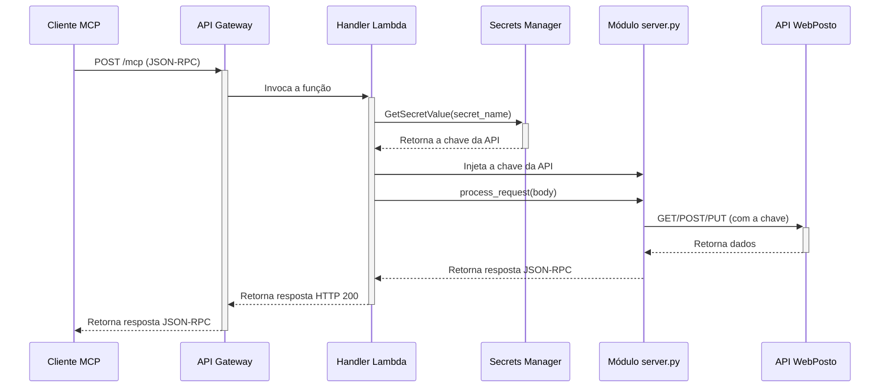

# Análise Detalhada da Implementação: `lambda_handler.v2.py`

Este documento fornece uma análise técnica aprofundada do `lambda_handler.v2.py`, o ponto de entrada para a execução do WebPosto MCP Server em um ambiente AWS Lambda. O foco está em como ele gerencia a autenticação segura e se integra com a lógica principal do servidor.

## Sumário

- [Objetivos do Design](#objetivos-do-design)
- [Fluxo de Execução Detalhado](#fluxo-de-execução-detalhado)
- [Componentes Chave](#componentes-chave)
  - [AWS Lambda Powertools](#aws-lambda-powertools)
  - [Gerenciamento de Segredos](#gerenciamento-de-segredos)
  - [Injeção de Dependência Dinâmica](#injeção-de-dependência-dinâmica)
  - [Processamento da Requisição MCP](#processamento-da-requisição-mcp)
- [Diagrama de Sequência](#diagrama-de-sequência)
- [Considerações de Performance e Segurança](#considerações-de-performance-e-segurança)

---

## Objetivos do Design

O `lambda_handler.v2.py` foi projetado com os seguintes objetivos em mente:

1.  **Segurança:** Evitar a exposição de credenciais (hardcoding) no código-fonte, utilizando o AWS Secrets Manager como a fonte única da verdade para a chave da API.
2.  **Performance:** Minimizar a latência em invocações subsequentes ("quentes") da Lambda através do cache em memória da chave da API.
3.  **Observabilidade:** Integrar com o AWS Lambda Powertools para gerar logs estruturados, traces distribuídos e métricas, facilitando o monitoramento e o troubleshooting.
4.  ** desacoplamento:** Manter o código do handler separado da lógica principal do servidor (`server.py`), permitindo que o servidor possa ser executado em diferentes ambientes (local, Docker, Lambda) sem modificações.

---

## Fluxo de Execução Detalhado

Quando uma requisição chega à API Gateway, o seguinte fluxo é executado:

1.  **Invocação da Lambda:** A API Gateway invoca a função Lambda, passando os detalhes da requisição HTTP no parâmetro `event`.

2.  **Contexto do Powertools:** O decorador `@logger.inject_lambda_context` captura os detalhes do evento e do contexto, enriquecendo os logs automaticamente.

3.  **Busca da Chave da API:**
    - A função `get_api_key_from_secrets_manager` é chamada.
    - Ela primeiro verifica se a chave já existe no cache em memória (`SECRET_CACHE`).
    - Se não, ela utiliza o `boto3` para fazer uma chamada à API `GetSecretValue` do AWS Secrets Manager.
    - A chave retornada é armazenada no cache para futuras invocações.

4.  **Injeção da Chave:**
    - A chave da API obtida é atribuída diretamente à variável global `API_KEY` no módulo `src.server` (`mcp_server.API_KEY = api_key`).
    - Esta é uma forma de **injeção de dependência dinâmica**. O `WebPostoClient`, dentro do módulo `server.py`, já está programado para usar esta variável global, garantindo que todas as chamadas subsequentes à API do WebPosto sejam autenticadas.

5.  **Processamento da Requisição:**
    - O corpo da requisição (`event['body']`) é extraído. Este corpo contém a mensagem JSON-RPC do cliente MCP.
    - A string JSON é passada para o método `mcp_server.mcp.process_request()`. Este método simula a leitura de uma linha do `stdin`, que é o modo de operação padrão do `FastMCP`.
    - O servidor MCP processa a mensagem, identifica a ferramenta a ser chamada (`tools/list`, `tools/call`, etc.), executa a lógica e retorna a resposta como uma string JSON.

6.  **Retorno da Resposta:**
    - A string de resposta do servidor MCP é convertida de volta para um dicionário Python.
    - O handler constrói uma resposta HTTP válida para a API Gateway, com `statusCode: 200`, headers de CORS e o corpo da resposta.

7.  **Tratamento de Erros:**
    - Se qualquer exceção ocorrer, blocos `try...except` capturam o erro, registram um log detalhado com o `logger.exception`, e retornam uma resposta HTTP com `statusCode` 400 ou 500, informando o cliente sobre o problema.

---

## Componentes Chave

### AWS Lambda Powertools

-   **`Logger`:** Gera logs em formato JSON estruturado, o que facilita a busca e análise no CloudWatch Logs Insights. O decorador `@logger.inject_lambda_context` adiciona automaticamente informações como `aws_request_id` a cada log.
-   **`Tracer`:** Captura metadados sobre a execução e os envia para o AWS X-Ray, permitindo a visualização de traces distribuídos e a identificação de gargalos de performance.

### Gerenciamento de Segredos

A função `get_api_key_from_secrets_manager` é o coração da estratégia de segurança.

```python
@tracer.capture_method
def get_api_key_from_secrets_manager(secret_name: str) -> str:
    # 1. Verifica o cache
    if secret_name in SECRET_CACHE:
        return SECRET_CACHE[secret_name]

    # 2. Se não estiver no cache, busca no Secrets Manager
    sm_client = boto3.client("secretsmanager")
    response = sm_client.get_secret_value(SecretId=secret_name)
    api_key = response["SecretString"]

    # 3. Armazena no cache para a próxima vez
    SECRET_CACHE[secret_name] = api_key
    return api_key
```

### Injeção de Dependência Dinâmica

O `lambda_handler` atua como um "orquestrador" que configura o ambiente para o `server.py`. A linha `mcp_server.API_KEY = api_key` é crucial. Ela modifica a variável global `API_KEY` no módulo `server` antes que qualquer ferramenta seja executada. Como o `WebPostoClient` (também no módulo `server`) lê essa variável global, ele passa a usar a chave correta em todas as suas requisições.

Isso evita a necessidade de passar a chave como parâmetro em todas as chamadas de função, mantendo o código das ferramentas limpo e focado em sua lógica de negócio.

### Processamento da Requisição MCP

A linha `response_str = mcp_server.mcp.process_request(body_str)` é onde a "mágica" acontece. O `FastMCP` foi projetado para operar sobre `stdin`/`stdout`. Este método simula esse comportamento, processando uma única string de entrada e retornando uma única string de saída, tornando-o compatível com o modelo de invocação da Lambda.

---

## Diagrama de Sequência



---

## Considerações de Performance e Segurança

-   **Cold Starts:** A primeira invocação da Lambda (cold start) terá uma latência maior devido à necessidade de inicializar o runtime do Python, carregar os módulos e fazer a chamada ao Secrets Manager. O cache de secrets ajuda a mitigar isso para invocações subsequentes.
-   **Permissões (IAM):** A IAM Role da função Lambda deve ter permissão explícita para `secretsmanager:GetSecretValue` no ARN do secret específico. O template SAM (`template.v2.yaml`) já configura isso automaticamente.
-   **Segurança do Segredo:** O valor do secret nunca é logado, graças ao uso do Powertools e boas práticas. Apenas a sua busca é registrada para o cache é registrada.
